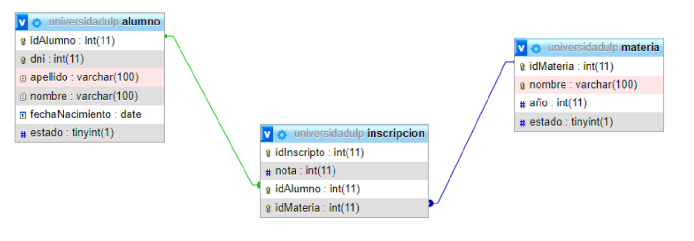
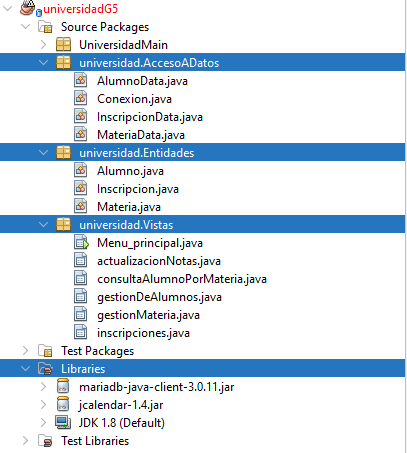
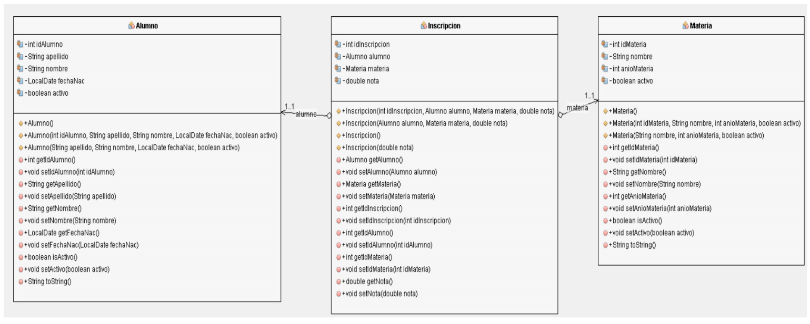
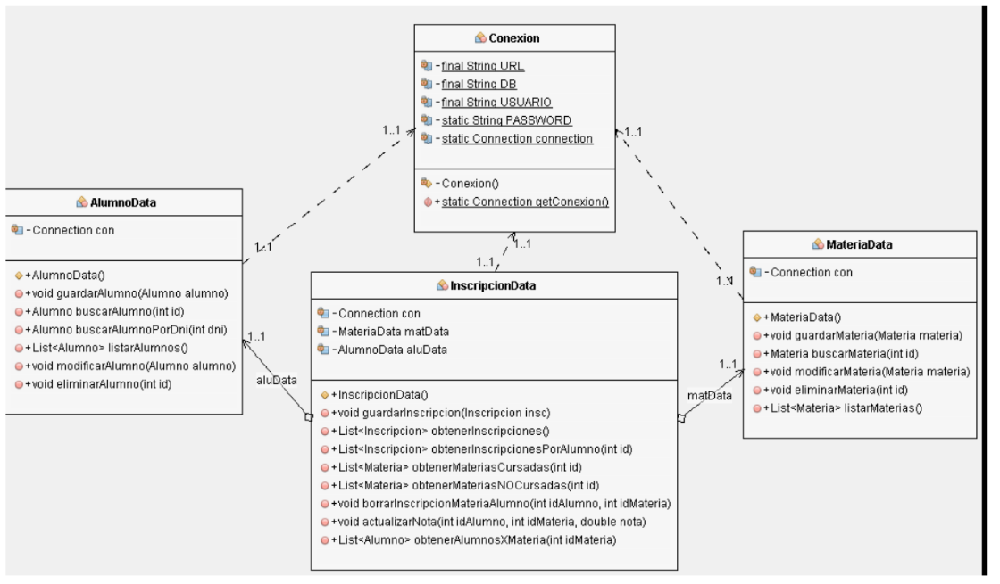
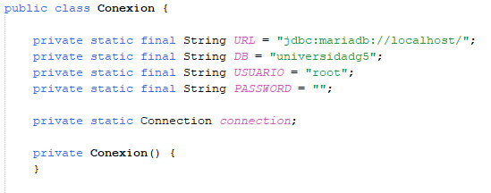
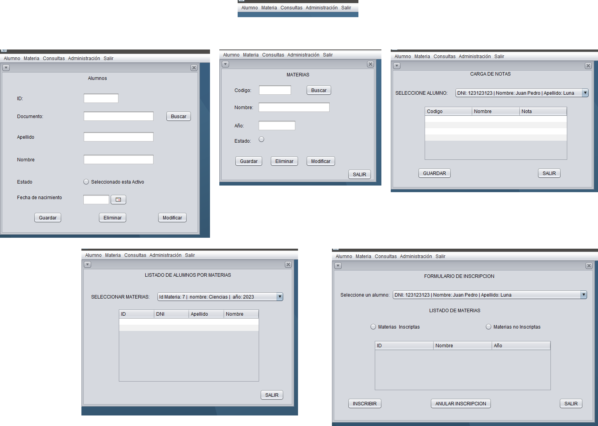

# Administración de Alumnos 

Es el proyecto de un software el cual gestiona alumnos de una universidad con interfaz grafica y trabaja con una base de datos MySQL.

El grupo el cual colaboro en la creación esta conformado por:

- Franco Nicolás Dorrego
- Walter Funes
- Cristian Briant Pimentel
- Lucia Giles

Se utilizo JAVA orientado a objetos en todo momento. 

# <h1>Forma de probarlo</h1>

Por el momento no esta compilado, por lo tanto vas a necesitar NetBeans o un editor de código el cual soporte JAVA. Luego XAMPP para tener acceso a la base de datos.

Para probarlo solo segui estos pasos: 
- Con XAMPP levanta el servidor y crea una base de datos en MySQL llamada **universidadg5**.
- Tenes un **archivo .sql** en el repositorio para crear la base de datos por completo.
- Una vez creada la base de datos, abri NetBeans y carga todo el proyecto dentro de El.
- Vas a necesitar cargar los drivers de **mariadB** y **jcalendar** a la parte de librerías.
- Por ultimo anda al paquete **.Vistas y ejecuta Menu_principal.java**

Con esos pasos vas a poder cargar todo el software y la base de datos, si no se carga la base de datos, dan avisos de error constantemente. 

# <h1>Base de Datos</h1>

Para la base de datos se utilizo MySQL. La base consta de 3 tablas:

-  Alumno
- Materia
- Inscripción (Contiene claves foráneas)

Estas 3 tablas contienen toda la información de la universidad.

****

Inscripción contiene 2 claves foráneas ya que relaciona las materas con un alumno, además de ello agrega una nota y un ID de inscripción propio. 

# <h1>Software</h1>

El software se compone de 3 paquetes principales para su funcionamiento:

- Acceso a datos: es el responsable de realizar las consultas a la base de datos. 
- Entidades: contiene los objetos principales en los cuales se basa la organización de los datos. 
- Vistas: contiene toda la interfaz grafica.

****

Cada paquete esta segmentado según su funcionamiento, cada uno depende del otro para funcionar. A continuación se puede ver como están compuestos estos paquetes en clases. 

# Paquete Entidades

Este paquete tiene dentro 3 Clases que son las mismas 3 tablas que están en la base de datos, cada clase representa una fila en una tabla en particular. No tiene métodos especiales, la gran mayoría son Get y Set. 

****

Se utilizo este enfoque para trabajar de forma segura y no tener inconsistencias a la hora de agregar una fila a alguna tabla en la base de datos. 

# Paquete Acceso a Datos

Contiene 4 clases dentro **MateriaData, InscripcionData, AlumnoData** son 3 clases que representan las actividades que podemos hacer en la base de datos. 

Un ejemplo, si quieres agregar un alumno al registro, solo instancias un objeto AlumnoData y llamas al método guardarAlumno. Este método recibe una instancia de Alumno (Clase que esta en paquete Entidades).

Este método dentro, tiene las consultas SQL ya preparas y las envía a la base de datos. Se pasa un alumno para sacar todos los atributos de la clase a agregarlos a esta consulta. 

Todos los posibles errores que se pueden causar en ejecutar la consulta, son tratados en estas clases. Luego de forma consiguiente los demás métodos realizan el mismo procedimiento cambiando su función a ejecutar. 

****

<h3>Clase Conexion</h3>

Esta clase es la encargada de establecer la conexión a la base de datos, si se necesita cambiar el nombre o el host donde esta la base, se pueden editar los atributos.

Esta clase tiene un constructor privado para asegurar solo crear una sola conexión a la vez.

****

# Paquete Vistas

Este paquete contiene todas las cases e instancias necesarias para dar la interfaz grafica al usuario.

Este mismo también es quien ejecuta los métodos de las cases del paquete Acceso a Datos. Es el encargado de tomar los datos que da el usuario y ejecutar sus cambios. 

El punto principal de todo es **Menu_Principal.java** Da el acceso a los demás JFRAME.

Existen en total 5 Frame, cada uno de ellos realiza una tarea en particular:

 - Formulario Alumno: Acá podes buscar, editar o agregar un alumno.
 - Formulario Materias: Acá podes buscar, editar o agregar una materia.
 - Consulta de Notas: Acá podes buscar y editar en base a un alumno todas las notas que tiene en todas las materias.
 - Listado por Materias: Acá podes buscar todos los alumnos que están inscriptos a una materia. 
 - Formulario Inscripción: Podes inscribir o anular la inscripción de un alumno en las materias.

****

**Como ya viste tiene un enfoque muy fuerte orientado a objetos todo el proyecto. Se uso de esta forma para evitar inconsistencias de datos o perdidas de los mismos.**

Este proyecto fue solo una demostración de como usar JAVA orientado a objetos y MySQL. Formo parte del proyecto educativo de Argentina programa y de la empresa EGG Educación.

